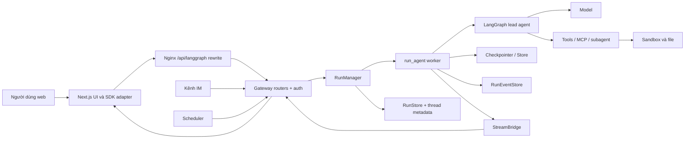

# DeerFlow qua mã nguồn: bản đồ và kiến trúc

Đọc theo thứ tự: **tài liệu này** → [luồng chạy và hợp đồng](runtime.md) → [tự xây dựng lại và bài tập](rebuild.md).

## Cách đọc và phạm vi

- **[Xác minh]**: kết luận trực tiếp từ đoạn code được dẫn. Liên kết `#L...` trỏ tới dòng tại thời điểm khảo sát (30-09-2026); khi code đổi, cần kiểm tra lại.
- **[Suy luận]**: lý do thiết kế hợp lý rút ra từ nhiều đoạn code; không phải cam kết của tác giả.
- **[Chưa xác định]**: chưa chạy live hoặc chưa khảo sát đủ để khẳng định.

Tôi đọc trực tiếp đường chat web → Gateway → runtime → graph và các nhánh đại diện: sandbox/file, subagent, MCP, lịch chạy, IM, cấu hình, persistence, auth. Tôi khảo sát tên và điểm nối của các module còn lại, nhưng **không** kiểm toán toàn bộ hơn 3.000 file hay từng provider/tool/extension. Cây thư mục bên dưới và các nhận định về nhánh phụ vì thế được giới hạn theo các file dẫn chứng.

## Danh sách khu vực ưu tiên đọc (kết quả khảo sát đầu tiên)

| Thứ tự | Khu vực | Câu hỏi cần trả lời | Điểm bắt đầu trong code |
|---|---|---|---|
| 1 | Khởi chạy, proxy | HTTP đi vào đâu, dịch vụ nào sống cùng nhau? | [Makefile](../../Makefile#L29-L49), [nginx.local.conf](../../docker/nginx/nginx.local.conf#L36-L80), [Gateway app](../../backend/app/gateway/app.py#L815-L850) |
| 2 | Gateway và run | Ai nhận yêu cầu, kiểm tra quyền, nhận run, trả SSE? | [thread_runs.py](../../backend/app/gateway/routers/thread_runs.py#L945-L1015), [services.py](../../backend/app/gateway/services.py#L1677-L1726), [RunManager](../../backend/packages/harness/deerflow/runtime/runs/manager.py#L1498-L1523) |
| 3 | Agent graph | Model, prompt, tool, middleware ghép thành agent ra sao? | [agent.py](../../backend/packages/harness/deerflow/agents/lead_agent/agent.py#L932-L1006), [ThreadState](../../backend/packages/harness/deerflow/agents/thread_state.py#L352-L369) |
| 4 | Công cụ và cô lập | Code/file chạy ở đâu, đường dẫn nào được phép? | [SandboxMiddleware](../../backend/packages/harness/deerflow/sandbox/middleware.py#L53-L87), [sandbox tools](../../backend/packages/harness/deerflow/sandbox/tools.py#L903-L966) |
| 5 | Lưu trữ và cấu hình | Cái gì bền vững, cái gì chỉ để stream? | [runtime bootstrap](../../backend/app/gateway/deps.py#L383-L464), [RunRow](../../backend/packages/harness/deerflow/persistence/run/model.py#L13-L60), [RunEventRow](../../backend/packages/harness/deerflow/persistence/models/run_event.py#L14-L36) |
| 6 | Frontend | Gửi, nhận incremental stream, tải lịch sử thế nào? | [useThreadStream](../../frontend/src/core/threads/hooks.ts#L1977-L1991), [submit](../../frontend/src/core/threads/hooks.ts#L2595-L2620), [history](../../frontend/src/core/threads/hooks.ts#L3105-L3145) |
| 7 | Mở rộng và chạy nền | Task, MCP, skill, scheduler, IM nối vào lõi ở đâu? | [task_tool.py](../../backend/packages/harness/deerflow/tools/builtins/task_tool.py#L669-L735), [mcp/tools.py](../../backend/packages/harness/deerflow/mcp/tools.py#L841-L887), [scheduler service](../../backend/app/scheduler/service.py#L28-L79), [ChannelService](../../backend/app/channels/service.py#L114-L157) |
| 8 | Test và vận hành | Hợp đồng nào được khóa bằng test, chạy thử từ đâu? | [boundary test](../../backend/tests/test_harness_boundary.py#L37-L46), [backend Makefile](../../backend/Makefile#L1-L34), [frontend package](../../frontend/package.json#L5-L19) |

## 1. Bức tranh tổng quan

**[Xác minh]** DeerFlow là ứng dụng chat với agent LangGraph: frontend Next.js nhận lời nhắn, Gateway FastAPI quản lý run và quyền truy cập, graph gọi model và tool, rồi phát tiến trình về UI. Mô tả này dựa vào trang chat gắn `useThreadStream`, lệnh `thread.submit`, API tạo/stream run và worker dùng `agent.astream`; không cần giả định rằng một model cụ thể luôn được cấu hình. [chat-page.tsx](../../frontend/src/components/workspace/chats/chat-page.tsx#L86-L114), [hooks.ts](../../frontend/src/core/threads/hooks.ts#L2595-L2620), [thread_runs.py](../../backend/app/gateway/routers/thread_runs.py#L963-L1015), [worker.py](../../backend/packages/harness/deerflow/runtime/runs/worker.py#L1326-L1352).

**[Xác minh]** Người dùng chính được code thể hiện là người dùng web có tài khoản/quyền `runs:create` và `runs:cancel`; ứng dụng cũng nhận sự kiện từ kênh IM và hỗ trợ công việc theo lịch. Tôi **suy luận** đây là một môi trường làm việc với agent có file, tool và tự động hóa, thay vì chatbot chỉ trả văn bản: `ThreadState` chứa artifact/todo/goal, tool registry có `present_file` và `task`, scheduler lưu prompt, còn ChannelService tạo MessageBus/ChannelManager. [chat-page.tsx](../../frontend/src/components/workspace/chats/chat-page.tsx#L86-L90), [thread_state.py](../../backend/packages/harness/deerflow/agents/thread_state.py#L352-L369), [tools.py](../../backend/packages/harness/deerflow/tools/tools.py#L34-L43), [scheduled_tasks/model.py](../../backend/packages/harness/deerflow/persistence/scheduled_tasks/model.py#L12-L35), [channels/service.py](../../backend/app/channels/service.py#L130-L157).

Luồng đầu cuối của một tin nhắn thông thường, **đã xác minh**:

1. UI giữ `threadId`, dựng danh sách `messages`, gọi `thread.submit` với `context`, `recursion_limit` và stream. [use-thread-chat.ts](../../frontend/src/components/workspace/chats/use-thread-chat.ts#L40-L64), [hooks.ts](../../frontend/src/core/threads/hooks.ts#L2595-L2620).
2. SDK gọi API qua base URL LangGraph; nginx viết lại `/api/langgraph/*` thành `/api/*` của Gateway. Adapter frontend ép mode tăng dần (`messages-tuple`, `updates`, `custom`) và bỏ option resumable mà Gateway không hỗ trợ. [api-client.ts](../../frontend/src/core/api/api-client.ts#L454-L486), [stream-mode.ts](../../frontend/src/core/api/stream-mode.ts#L41-L58), [stream-mode.ts](../../frontend/src/core/api/stream-mode.ts#L83-L105), [nginx.local.conf](../../docker/nginx/nginx.local.conf#L65-L80).
3. Gateway xác thực/quyền, chuẩn hóa request, nhận run một cách nguyên tử rồi gắn worker nền. [auth_middleware.py](../../backend/app/gateway/auth_middleware.py#L90-L118), [thread_runs.py](../../backend/app/gateway/routers/thread_runs.py#L963-L984), [services.py](../../backend/app/gateway/services.py#L1706-L1726), [services.py](../../backend/app/gateway/services.py#L2112-L2126).
4. Worker lắp agent, gắn checkpointer/store, gọi `astream`, gửi frame qua `StreamBridge`, ghi sự kiện vào journal và trạng thái cuối vào run store. [worker.py](../../backend/packages/harness/deerflow/runtime/runs/worker.py#L1125-L1152), [worker.py](../../backend/packages/harness/deerflow/runtime/runs/worker.py#L1294-L1352), [journal.py](../../backend/packages/harness/deerflow/runtime/journal.py#L222-L265), [worker.py](../../backend/packages/harness/deerflow/runtime/runs/worker.py#L1471-L1520).
5. UI cập nhật theo stream; khi mở lại chat, UI hỏi `/messages/page` từ event feed và hợp nhất lịch sử với trạng thái hiện tại. [hooks.ts](../../frontend/src/core/threads/hooks.ts#L1977-L1991), [hooks.ts](../../frontend/src/core/threads/hooks.ts#L3105-L3145), [thread_runs.py](../../backend/app/gateway/routers/thread_runs.py#L1586-L1611).

## 2. Bản đồ repository và điểm khởi chạy

```text
deer-flow/
├─ Makefile; scripts/serve.sh; docker/nginx/; docker/docker-compose*.yaml
├─ config.example.yaml; extensions_config.example.json
├─ backend/
│  ├─ app/gateway/         FastAPI, auth, routers, runtime bootstrap
│  ├─ app/channels/        cầu nối IM; app/scheduler/ lịch chạy
│  ├─ packages/harness/deerflow/
│  │  ├─ agents/           graph, prompt, middleware, ThreadState, memory
│  │  ├─ runtime/          run manager/worker, checkpoint, event, stream
│  │  ├─ sandbox/          provider, lease, file và shell tools
│  │  ├─ tools/; mcp/; skills/; subagents/; extensions/
│  │  ├─ config/; persistence/; models/
│  ├─ packages/extension-api/  hợp đồng plugin công khai
│  └─ tests/
├─ frontend/src/app/      Next.js routes
├─ frontend/src/components/workspace/  giao diện chat/workspace
├─ frontend/src/core/     API client, hooks, state theo tính năng
├─ frontend/tests/
├─ contracts/             JSON contract dùng qua ranh giới module
├─ skills/public/; examples/; deploy/; docs/
```

**[Xác minh]** Điểm chạy local là `make dev` → `scripts/serve.sh --dev`; riêng Gateway là `uvicorn app.gateway.app:app` ở cổng 8001, frontend dùng `pnpm dev` ở 3000 và nginx ở 2026. Docker production đặt nginx làm cổng công khai mặc định trên loopback. [Makefile](../../Makefile#L102-L111), [Makefile](../../Makefile#L173-L184), [backend/Makefile](../../backend/Makefile#L5-L16), [nginx.local.conf](../../docker/nginx/nginx.local.conf#L36-L57), [docker-compose.yaml](../../docker/docker-compose.yaml#L44-L55). **[Chưa xác định]** Tôi chưa chạy full stack trong môi trường này.

**[Xác minh]** Điểm tạo ứng dụng là `create_app()`; nó gắn auth/CSRF/CORS và các router. `lifespan()` khởi tạo runtime; `langgraph_runtime()` tạo stream bridge, engine SQL, checkpointer và store, rồi đăng các dependency vào `app.state`. [app.py](../../backend/app/gateway/app.py#L815-L850), [app.py](../../backend/app/gateway/app.py#L912-L913), [app.py](../../backend/app/gateway/app.py#L977-L989), [app.py](../../backend/app/gateway/app.py#L1045-L1132), [deps.py](../../backend/app/gateway/deps.py#L383-L464).

**[Xác minh]** `packages/harness/deerflow` là lớp lõi dùng lại; `app` gọi `deerflow`, và test AST cấm harness import `app.*`. Đây là ranh giới phụ thuộc rõ nhất của backend. [test_harness_boundary.py](../../backend/tests/test_harness_boundary.py#L1-L15), [test_harness_boundary.py](../../backend/tests/test_harness_boundary.py#L37-L46). **[Suy luận]** Ranh giới này cho phép thay HTTP/IM host mà giữ nguyên graph, tool và persistence contract; lý do cụ thể của tác giả không được code chứng minh.

## 3. Kiến trúc và lý do tổ chức



Các cạnh quan trọng **được xác minh**: Gateway `start_run` nhận qua `RunManager`, worker gọi graph; `ChannelService` và `ScheduledTaskService` là các đầu vào khác; worker ghi bridge/journal và gắn checkpointer/store. [services.py](../../backend/app/gateway/services.py#L1677-L1726), [services.py](../../backend/app/gateway/services.py#L2038-L2052), [channels/service.py](../../backend/app/channels/service.py#L130-L157), [scheduler/service.py](../../backend/app/scheduler/service.py#L28-L79), [worker.py](../../backend/packages/harness/deerflow/runtime/runs/worker.py#L868-L892), [worker.py](../../backend/packages/harness/deerflow/runtime/runs/worker.py#L1294-L1352).

| Thành phần | Trách nhiệm đã xác minh | Lý do thiết kế suy luận từ code |
|---|---|---|
| Gateway | HTTP, auth, quyền theo tài nguyên, validate request và dùng các singleton runtime. [auth_middleware.py](../../backend/app/gateway/auth_middleware.py#L90-L118), [thread_runs.py](../../backend/app/gateway/routers/thread_runs.py#L945-L984), [deps.py](../../backend/app/gateway/deps.py#L1-L15) | Tập trung quyền và admission để mọi nguồn vào phải qua cùng hợp đồng run. |
| RunManager + DB | Một run có trạng thái/owner/lease/idempotency; index DB chỉ cho một run `pending`/`running` trên thread. [manager.py](../../backend/packages/harness/deerflow/runtime/runs/manager.py#L184-L231), [run/model.py](../../backend/packages/harness/deerflow/persistence/run/model.py#L62-L78) | Đồng bộ vòng đời kể cả nhiều request/worker; không trông vào lock tiến trình. |
| Graph + middleware | Lắp model/tool/prompt và middleware theo request/config; state có reducer riêng cho nhiều channel. [agent.py](../../backend/packages/harness/deerflow/agents/lead_agent/agent.py#L932-L1006), [agent.py](../../backend/packages/harness/deerflow/agents/lead_agent/agent.py#L486-L553), [thread_state.py](../../backend/packages/harness/deerflow/agents/thread_state.py#L352-L369) | Bổ sung năng lực và chính sách quanh agent loop mà không viết một vòng điều khiển khổng lồ. |
| StreamBridge | `publish`, `subscribe(last_event_id)`, `publish_end`, báo gap khi replay không đầy đủ. [base.py](../../backend/packages/harness/deerflow/runtime/stream_bridge/base.py#L19-L54), [base.py](../../backend/packages/harness/deerflow/runtime/stream_bridge/base.py#L81-L112) | Tách worker sản xuất token khỏi HTTP SSE và cho phép nối lại trong giới hạn bộ đệm. |
| Checkpoint / event / file | Checkpoint là graph state; event feed có `thread_id,run_id,seq`; sandbox/file sống ở filesystem riêng. [thread_state.py](../../backend/packages/harness/deerflow/agents/thread_state.py#L352-L369), [run_event.py](../../backend/packages/harness/deerflow/persistence/models/run_event.py#L14-L36), [paths.py](../../backend/packages/harness/deerflow/config/paths.py#L11-L29) | Các nhu cầu khôi phục graph, hiển thị lịch sử và lưu artifact khác nhau; một kho không đáp ứng gọn cả ba. |

Một quyết định đáng học: **[Xác minh]** config request được đọc mới bằng `get_app_config()`, trong khi engine/bridge/checkpointer được chụp một lần lúc startup. Danh mục `STARTUP_ONLY_FIELDS` ghi các trường cần restart. **[Suy luận]** điều này tránh thay provider/kết nối giữa lúc run còn dùng chúng nhưng vẫn cho phép cập nhật tham số per-run. [app_config.py](../../backend/packages/harness/deerflow/config/app_config.py#L725-L746), [deps.py](../../backend/app/gateway/deps.py#L383-L400), [reload_boundary.py](../../backend/packages/harness/deerflow/config/reload_boundary.py#L39-L69).

Một quyết định khác: **[Xác minh]** frontend vẫn gọi `streamResumable: true`, nhưng adapter loại nó trước khi gửi; server từ chối `stream_resumable=true`, còn adapter tự xử lý reconnect/gap bằng `joinStream` và tải snapshot. **[Suy luận]** đây là lớp tương thích với SDK, không phải resumable stream chuẩn của Gateway. [hooks.ts](../../frontend/src/core/threads/hooks.ts#L2595-L2613), [stream-mode.ts](../../frontend/src/core/api/stream-mode.ts#L41-L58), [run_models.py](../../backend/app/gateway/run_models.py#L148-L160), [api-client.ts](../../frontend/src/core/api/api-client.ts#L498-L515).
